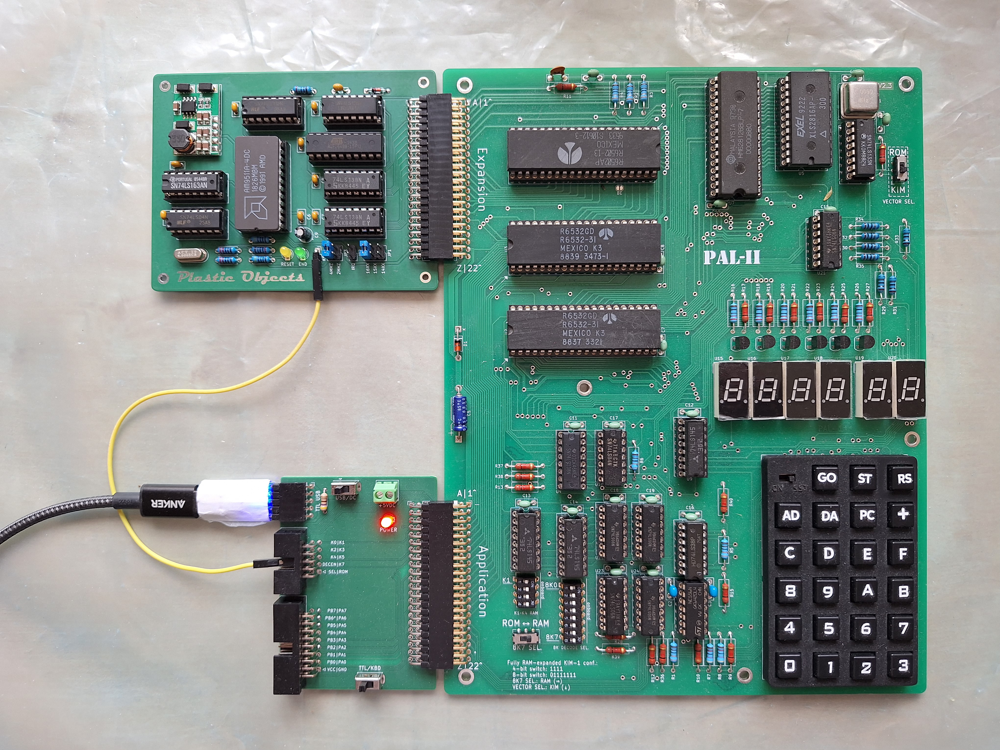
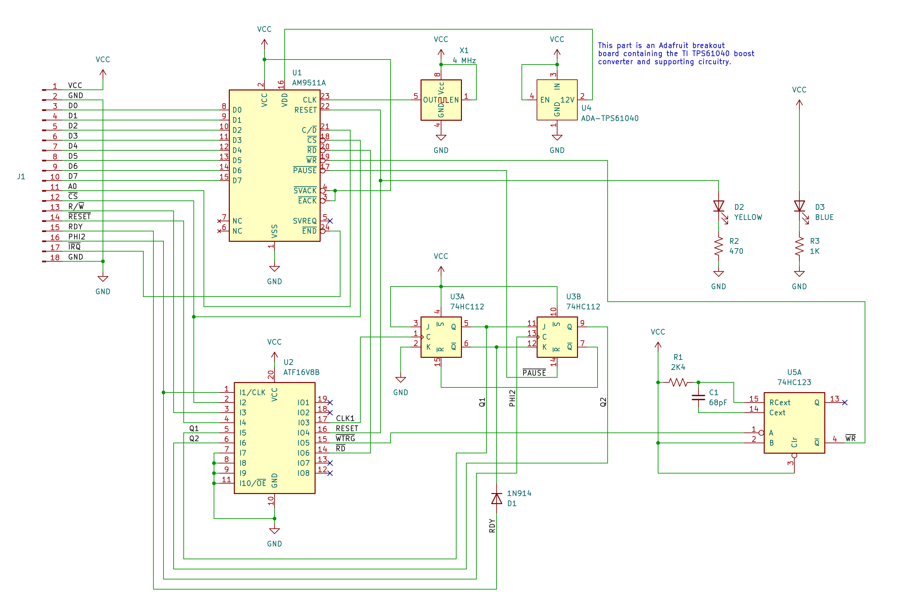

AM9511 Interface Module for the PAL-2
=====================================

The AMD AM9511 Arithmetic Processing Unit, first produced in the late 
1970s, provides hardware support for high performance fixed and floating 
point arithmetic and a variety of floating point trigonometric and 
mathematical operations, for use with microprocessors of that period.

This repository provides schematics and board design for a module that
can be connected to the PAL-2 Expansion interface.

The design is adapted from the work of Harris, who in turn based his
implementation on designs by Kissel and Currie[2] in which they 
developed an experiment using a MOS 6502 microprocessor to control 
four AM9511A floating-point arithmetic units, and from Hart’s 
MICROCRUNCH[3] which also used the AM9511A (Intel 8231A) interfaced 
with a (Rockwell) 6502.

See [am9511-6502-description.pdf](am9511-6502-description.pdf) for a
full description of the interface circuit design and 
[am9511-6502-schematic.pdf](am9511-6502-schematic.pdf) for the schematic.

The specification here anticipates the use of an AM9511A clocked at
4 MHz. However, the same design will work with earlier versions of the 
AM9511, by setting JP to 2Mhz or by swapping the 4 MHz clock oscillator 
with a unit of an appropriately lower speed.

The `logic` folder contains the programming details for the ATF16V8B
used in the circuit, as produced by [Galette](https://github.com/simon-frankau/galette) 
from the `am9511-logic.pld` source file. The provided JEDEC file
(`am9511-logic.jed`) can be easily programmed into an ATF16V8B using 
[minipro](https://gitlab.com/DavidGriffith/minipro).

Also included in the `docs` folder are source documents cited below, as 
well as datasheets and supplementary documents for the AM9511.

---
1. Harris, CE: "AM9511 Interface Module for the 6502"; July 2025; [GitHub](https://github.com/ceharris/am9511-6502)
2. Kissel, R and Currie, J: "Hardware Math for the 6502 Microprocessor"; 
   July 1985; NASA TM-86517
3. Hart, J: "MICROCRUNCH: An Ultra-Fast Arithmetic Computing System 
   (part 1)"; August 1981; MICRO - the 6502/6809 Journal (No. 39)
