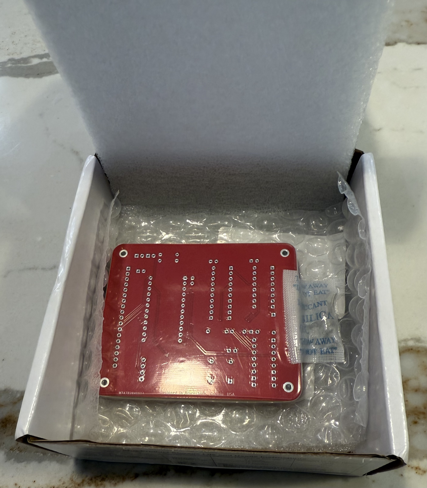
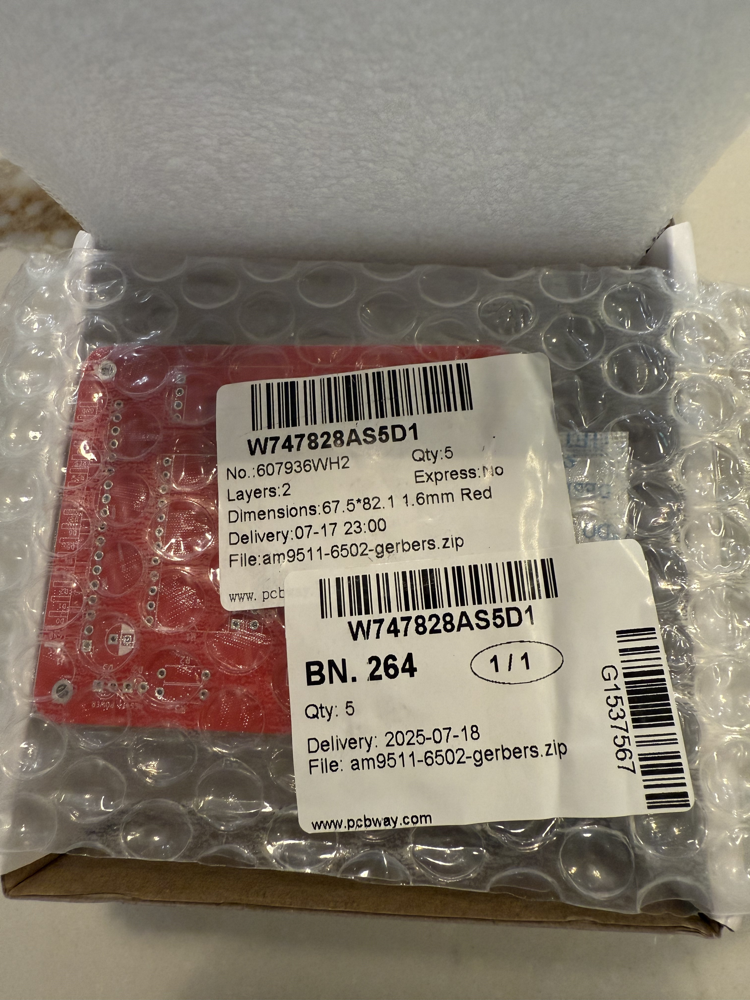
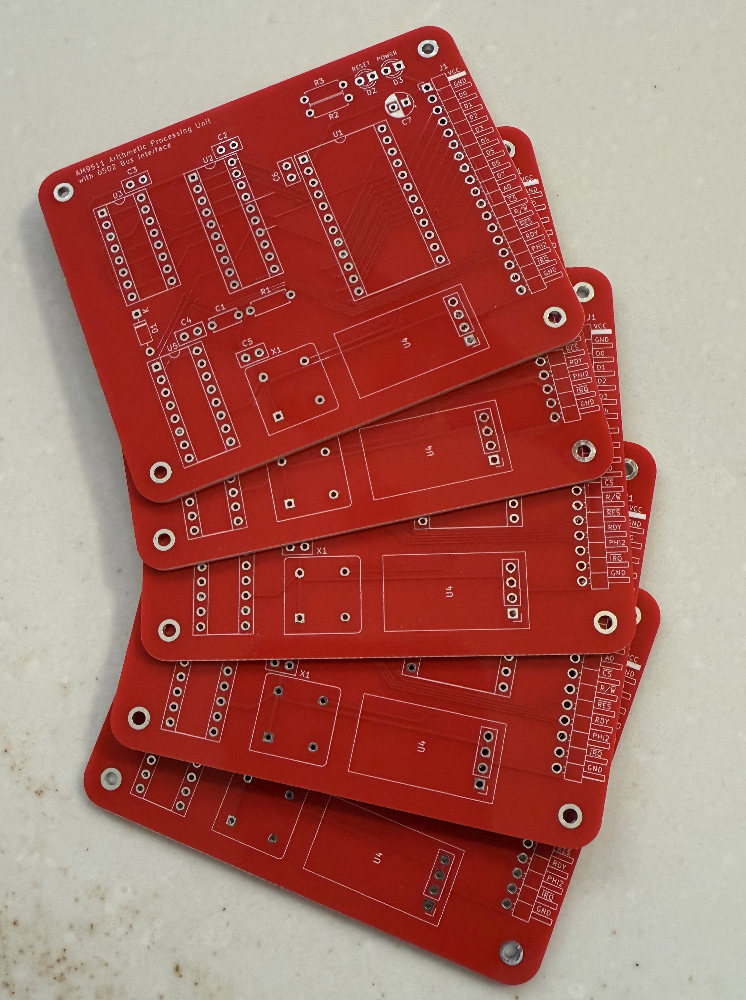
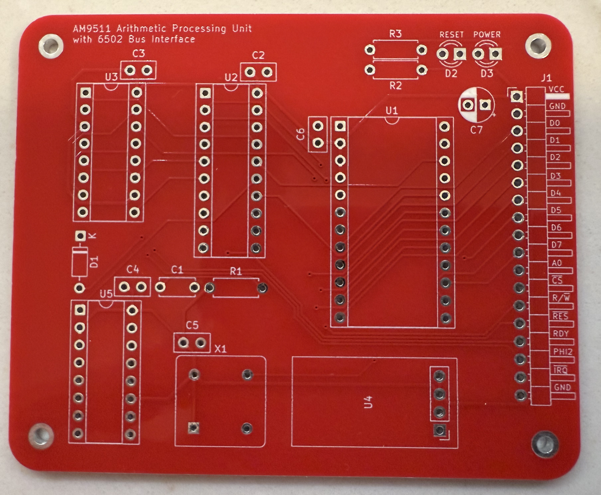

Prototype PCB fabrication services were provided to this project through the generous sponsorship of [PCBWay](https://pcbway.com). PCBWay offers a variety of fabrication and assembly services that are accessible and affordable to hobbyist makers like myself.

For this project, I selected their PCB Prototype service. The online ordering process was easy. I uploaded a ZIP archive containing the Gerber fabrication outputs produced by KiCad, and their online order process quickly and correctly deduced the specifications for my project. The order form indicated that the Gerber upload feature is still in beta testing, but it worked as expected. There was one minor issue with the PCB preview function, but the order form included a reassuring description that the previewer is still under development and that a subsequent engineering review would ensure that the specification was correctly received and interpreted.

After the Gerber upload process was completed, I simply selected the material, solder mask color, and surface finish, and otherwise used the defaults selected automatically for me. From there, I was presented with a quote for cost and estimated shipping and I completed my order.

After placing the order, an engineering review followed, in which PCBWay validated the specifications for my order and produced accurate 2D images of the PCB, front and back, using the Gerber outputs that I uploaded. I was also presented with an estimate of the time required to fabricate and ship the completed boards. Fabrication times were comparable to other providers of fabrication services. As the order progressed through the process, I could easily check the current status via the PCBWay web site.
The finished product was delivered well within their estimate of the timeframe. 

For this project I chose the least expensive surface finish (HASL), but I also found the pricing for their lead-free HASL and ENIG finishes to be competitive with other fabricators that I have used.

The quality of the boards is top notch. The HASL finish solders very easily, the solder mask color and finish is flawless, and the silkscreen elements are bright and sharp. I chose a red solder mask for this project, but PCBWay offers a variety of other solder mask colors.

As you can see in the unboxing photos below, the boards were carefully packaged for shipment, hermetically sealed to prevent contamination. The order included the minimum of five copies of my board design for a very reasonable price. 

As expected, the charge for shipping was the largest component of the overall cost. As a resident of United States, there were also cost components for VAT and tariffs.

